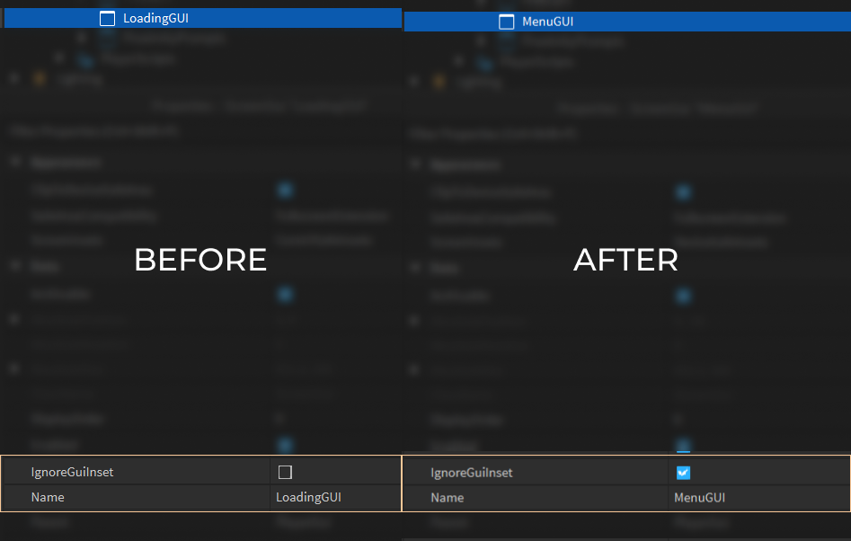

# Updating properties

If you want to update an existing instance, then the `Update` function is here to help!

## Parameter order

1. Instance to update | `Instance`
2. Table of properties **(optional)** | `{ [any]: any }?`
3. Table of instances to add **(optional)** | `{ [any]: Instance }?`

## Example usage

```lua:line-numbers {4-7}
local Update = Aegis.Update
local UI = PlayerGui:WaitForChild("LoadingUI")

Update(UI, {
	Name = "MenuGUI",
	IgnoreGuiInset = true,
})
```

## Explanation

1. We call the `Update` function and pass the instance to update as the first parameter.

```lua
Update(UI)
```

2. The second parameter will be the table of properties which will be applied to the instance.

```lua{2-5}
Update(UI,
	{
		Name = "MenuGUI",
		IgnoreGuiInset = true,
	}
)
```

3. The third parameter will be a table of children instances which will be parented to the instance.

- [Similar to `new` constructor](/guide/new-instances#explanation)



::: info
The only difference of the `Update` function from the `new` constructor is the 1st parameter where in `new`, the first parameter is the class name and in `Update`, the first parameter is an Instance.
:::
